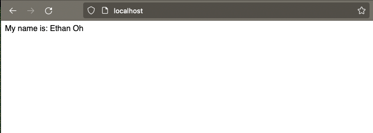

# Docker Nginx Flask Project 

## Summary

The goal here was to start getting familiar with webservicing, Nginx and Docker. The concept of Docker deployment locally and on the web was explored using CLI docker commands. e.g. docker compose up --build to deploy to locahost.

## Screenshot of Running Program

